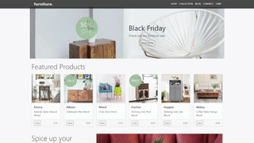

# [FSI TouchZoom](https://www.neptunelabs.com) &middot; Samples
| ***Pixel-perfect*** | ***High-DPI-ready*** | ***Fast :rocket:*** | ***Hackable*** | ***Consistent*** |
|:-----------------:|:-------------:|:---------------:|:---------------:|:---------------:|

[](https://github.com/neptunelabs/fsi-layers-samples/blob/main/LICENSE)


FSI TouchZoom is an HTML5 and Javascript based tool adding image zoom to touch enabled devices.
When pinch zooming into a website containing single source images provided by FSI Server, the images will be displayed in the resolution matching the current magnification.
The real-time scaling capabilities of the image server are used to achieve pixel-perfect results.
FSI TouchZoom can be added to all images on the site, controlled via CSS classes and/or via JavaScript API.

This repository contains examples on how to use and build your own applications.



## Getting Started

Without starting this project in your IDE, you can discover, develop and customize
all demos in JSFiddle.

[Flowers in JSFiddle][flowjsf]

[Trains in JSFiddle][trainsjsf]

[Kitchen in JSFiddle][kitchenjsf]

[Product Detail Page in JSFiddle][pdpjsf]

[flowjsf]: https://jsfiddle.net/gh/get/library/pure/neptunelabs/fsi-jsfiddle-samples/tree/master/fsi-layers-samples/flowers
[kitchenjsf]: https://jsfiddle.net/gh/get/library/pure/neptunelabs/fsi-jsfiddle-samples/tree/master/fsi-layers-samples/kitchen
[pdpjsf]: https://jsfiddle.net/gh/get/library/pure/neptunelabs/fsi-jsfiddle-samples/tree/master/fsi-layers-samples/pdp
[trainsjsf]: https://jsfiddle.net/gh/get/library/pure/neptunelabs/fsi-jsfiddle-samples/tree/master/fsi-layers-samples/trains

## Start and develop

To run and modify this samples:

#### NPM

```shell
npm install
npm start
```
or

#### Yarn

```shell
yarn
yarn start
```

Now you can customize the demo according to your own preferences or develop something new.

You can find a very simple example to start with in the ``samples/starter`` folder.

## How it works

These examples rely on a framework that uses [Grunt][Grunt], [Browsersync][Browsersync],
[Bootstrap][Bootstrap] and Sass to launch a local server,
replace template variables and pass changes directly to the browser window.

However, these dependencies are generally **not required** for the use of FSI Layers!

## Requirements

To run the demo you do not need your own image server.
If you don't have your own server but still want to use your own images,
you can use an [evaluation copy][Server] indefinitely.
In case of an own server, please copy ``env.yml.dist`` to ``env.yml`` and
change the settings.


## Documentation

Official JS API Docs can be found here: [https://docs.neptunelabs.com/fsi-viewer/latest/fsi-layers][Docs]

[Docs]: https://docs.neptunelabs.com/fsi-viewer/latest/fsi-layers
[Server]: https://www.neptunelabs.com/get/
[Grunt]: https://gruntjs.com/
[Browsersync]: https://browsersync.io/
[Bootstrap]: https://getbootstrap.com/
