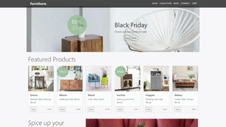

# [FSI TouchZoom](https://www.neptunelabs.com/fsi-touchzoom/) &middot; [Samples][GHPages]

| **_Pixel-perfect_** | **_High-DPI-ready_** | **_Fast :rocket:_** | **_Hackable_** | **_Consistent_** |
| :-----------------: | :------------------: | :-----------------: | :------------: | :--------------: |

[](https://github.com/neptunelabs/fsi-layers-samples/blob/main/LICENSE)

FSI TouchZoom is a tool that adds image zoom to touch enabled devices. When pinch zooming on a website containing single source images provided by the
FSI Server, the images are displayed at the resolution appropriate to the current zoom level.
The real-time scaling capabilities of the image server are used to achieve pixel-perfect results.
FSI TouchZoom can be applied to any image on the site or controlled using CSS classes.
It can also be created and controlled using the JavaScript API.

This repository contains examples on how to use and build your own applications.

[][GHPages]

## Getting Started

Without starting this project in your IDE, you can discover all the
demos on the [GitHub Pages][GHPages] or develop and customise in [StackBlitz][Stackblitz].

## Start and develop

To run and modify this samples:

#### NPM

```shell
npm install
npm start
```

or

#### Yarn

```shell
yarn
yarn start
```

Now you can customize the demo according to your own preferences or develop something new.

You can find a very simple example to start with in the `samples/starter` folder.

## How it works

These examples rely on a framework that uses [Grunt][Grunt], [Browsersync][Browsersync],
[Bootstrap][Bootstrap] and Sass to launch a local server,
replace template variables and pass changes directly to the browser window.

However, these dependencies are generally **not required** for the use of FSI Server!

## Requirements

To run the demo you do not need your own image server.
If you don't have your own server but still want to use your own images,
you can use an [evaluation copy][Server] indefinitely.
In case of an own server, please copy `env.yml.dist` to `env.yml` and
change the settings.

## Documentation

For further information on the FSI Viewer and FSI Server, please refer to the official [documentation][Docs].

[Docs]: https://docs.neptunelabs.com/docs/fsi-touchzoom
[Server]: https://www.neptunelabs.com/get/
[Grunt]: https://gruntjs.com/
[Browsersync]: https://browsersync.io/
[Bootstrap]: https://getbootstrap.com/
[GHPages]: https://neptunelabs.github.io/fsi-touchzoom-samples/
[Stackblitz]: https://stackblitz.com/edit/fsi-touchzoom-samples
