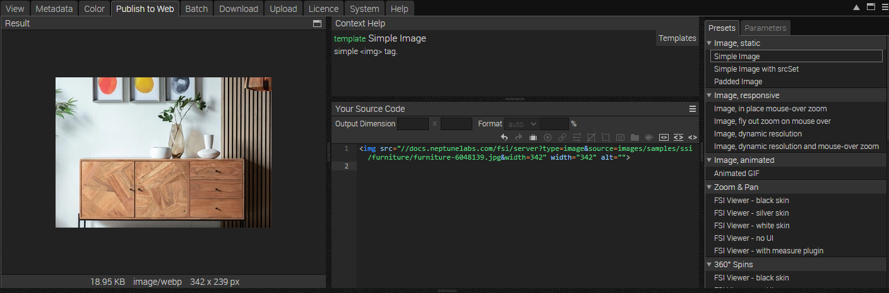
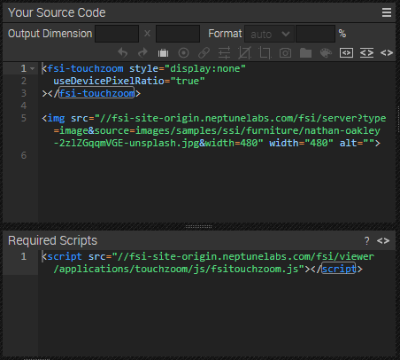

# Frontpage - Using FSI TouchZoom & Single Source Imaging

This readme describes how the front page sample with *FSI TouchZoom* and *Single Source Imaging* of *FSI Server* is achieved.
The aim of the demo is to show how you can easily integrate different sizes and formats of an image by simply changing the Image URL.
It also shows how FSI TouchZoom is used.

# Use images on the website

While having an image or folder selected, you can see all possible publishing ways for the specific item by visiting the "Publish To Web" tab.
For this example, select the preset *Image, dynamic resolution* in the section **Image, responsive**:



The *Source Code* section enables you to control the look of your image or viewer by setting the output dimensions and format (auto automatically chooses the best format for the browser used, or you can set WEBP, JPEG, PNG or GIF), as well as adding effects or crop options to it.
In this area you also can see the source code for your selected publishing option which you can edit and copy to publish the images.



You can then add the images to your site via image tag:

```html
 
```
You can change the width and/or height directly in the image tag, the image will scale accordingly.

# Using TouchZoom

In order to display all images with TouchZoom, you only need to add the corresponding script
to the head of your website:

```html
<script
  src='https://docs.neptunelabs.com/fsi/viewer/applications/touchzoom/js/fsitouchzoom.js'
</script>
```
This ensures that FSI TouchZoom is loaded and all images will be displayed in the resolution matching the current magnification.
This way, sharp images on mobile devices are guaranteed.
You can also see this if you resize your browser window or change between different displays.

## Testing with examples from your own server

To test the examples with images from your own [FSI Server](https://www.neptunelabs.com/fsi-server/), please first copy the env.yml.dist file to env.yml and adapt the file, then restart the main demo again.
