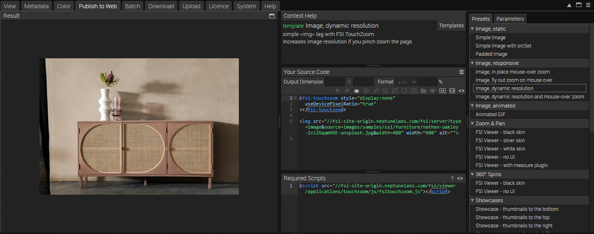
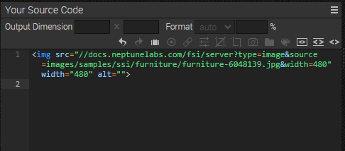

# Product Listing Page - Using FSI TouchZoom & Single Source Imaging

This readme describes how the product listing page example is achieved using *FSI TouchZoom* and *Single Source Imaging* from *FSI Server*.
The aim of the demo is to show how you can easily integrate different sizes and formats of an image by simply changing the image URL.
It also shows how to use FSI TouchZoom.


# Use images on the website
With an image or folder selected, you can see all the publishing options for that item by going to the Publish to Web tab.
For this example, select the 'Image, dynamic resolution' preset in the 'Image, responsive' section:


The Source Code section allows you to control the appearance of your image or viewer by setting the output dimensions and format (Auto automatically selects the best format for the browser used, or you can set WEBP, JPEG, PNG or GIF), as well as adding effects or cropping options.
This section also displays the source code for your chosen publishing option, which you can edit and copy to publish your images.



You can then add the images to your site using the image tag:

```html
 
```
You can change the width and/or height directly in the image tag, the image will scale accordingly.

# Using TouchZoom

In order to display all images with TouchZoom, you just need to add the corresponding script
to the head of your website:

```html
<script
  src='https://fsi.domain.tld/fsi/viewer/applications/touchzoom/js/fsitouchzoom.js'>
</script>
```

In our example, this is done through the framework, but you can see that the script is loaded when the page is compiled.
This ensures that FSI TouchZoom is loaded and all images are displayed at the correct resolution for the current zoom level.
This ensures sharp images on mobile devices.
You can also see this when you resize your browser window or switch between different displays.

# Enabling/ disabling FSI TouchZoom by using CSS classes

You can also restrict FSI TouchZoom to specific images and enable or disable it via a CSS class.
Simply embed an FSI TouchZoom tag anywhere on your page:

```html
<fsi-touchzoom style="display:none"
useDevicePixelRatio="true"
enableByCSSClass="zoom"
></fsi-touchzoom>
```
In this example, TouchZoom will only be used for images with the class *zoom*.

```html
<img class="zoom card-img-top img-fluid" src="https://fsi.domain.tld/fsi/server?type=image&source=images/samples/ssi/furniture/living-room-7225005.jpg&width=3428&rect=0.00131,0.00117,0.56176,0.99883" width="342"
```

You could also use *disableByCSSClass="noZoom"* for example.

For all parameters which can be used, please consult the [manual](https://docs.neptunelabs.com/fsi-viewer/latest/fsi-touchzoom).

## Testing with examples from your own server

To test the examples with images from your own [FSI Server](https://www.neptunelabs.com/fsi-server/), please first copy the env.yml.dist file to env.yml and adapt the file, then restart the main demo again.
